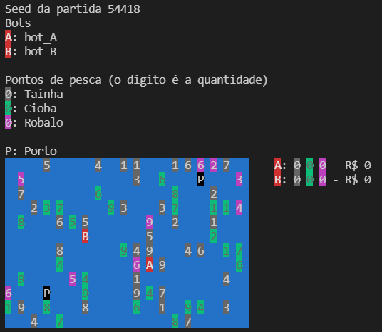

# OCMA
Jogo de simulação em uma área de pesca gerenciada pelo OCMA - Órgão de Controle do Meio Ambiente.

## Introdução

O litoral nordestino é cheio de recursos naturais que estão desaparecendo devido à exploração indiscriminada. Estes recursos são necessários para milhares de pessoas, inclusive para por na mesa seu alimento diário. Nossa fauna marinha é um exemplo disso. Temos uma grande variedade peixes: pargo, cioba, ariacó, dentão, guaíba, sirigado, robalo, badejo, serra, cavala... Enfim, são muitos. Porém, o que deveria ser uma atividade sustentável, a pesca dos animais que ainda não chegaram à fase de reprodução, sem importar o tamanho ou idade, passa a ser insustentável (literalmente). Com o tempo, a população diminui e torna-se um risco à espécie... e à mesa das pessoas.

Com o avanço da tecnologia, dos robôs, carros autônomos e outras inovações, não é difícil imaginar que a autonomia chegue à indústria pesqueira. Barcos inteligentes poderão, no futuro, ser capazes de pescar sem intervenção humana, seguindo normas rígidas do controle ambiental(*). Caso algum pescador inescrupuloso alteresse a programação do barco, sua "caixa preta" (necessária para ter autorização de pesca) denunciaria suas irregularidades.

A dificuldade para os pescadores do futuro será, portanto, de programar seus barcos inteligents de forma a maximizar a pesca, em um ambiente onde outros barcos-pescadores também competem pelos mesmos recursos naturais, mas sem infringir a regulamentação do controle ambiental.

O presente projeto consiste em criar um bot que controla um barco-pesqueiro inteligente. Esse bot irá competir com outros bots como se estivessem em um jogo. Ganha quem programou o bot que obtém, no final do jogo, o maior lucro. Quanto mais peixe, mais dinheiro. Mas se alguma norma for infringida... a multa será dolorosa!

(*) - com esperança que, nessa época, o controle ambiental ainda não tenha sido completamente destruído.

## Visão geral

Seu objetivo é conduzir seu barco-pesqueiro em uma área de pesca e, ao final de um dado número de rodadas, obter um saldo (com a venda dos peixes) maior que o dos seus colegas. Os barcos partem de um porto (pode haver mais de um) para pescar. Eles possuem um reservatório com uma capacidade máxima de peixes e, portanto, em algum momento, devem retornar a um porto (qualquer um) para realizar a venda do que pescaram, esvaziando suas cargas antes de retornar ao mar.

Porém, cuidado! Caso o barco saia da área de pesca, será multado. Caso o barco pesque mais que a capacidade máxima de peixes que suporta, será multado. Caso o barco pesque mais do que o permitido em um ponto de pesca, também será multado. E, neste último caso, perderá a licença de pesca... ou seja, fim de jogo.

Há 3 espécies de peixe presentes na área: Robalo, Cioba e Tainha, cada um com seu valor no mercado. Os preços (nesse futuro fictício) são:

* Robalo: R$ 200/kg
* Cioba: R$ 150/kg
* Tainha: R$ 100/kg

Então, é importante priorizar os peixes que irão pescar porque o barco possui uma uma capacidade máxima de peixes que pode levar. O barco só consegue transportar 10kg de peixes, independentemente do tipo. A limitação de quantos quilos o barco consegue transportar deve ser seguida à risca, sob pena de levar uma multa de R$ 500 por quilo excedente. Esteja, portanto, atento para não pescar mais que este limite. Para pescar além de 10kg, o barco deve retornar a um porto (qualquer um) e vender sua carga. Assim, irá ganhar o dinheiro relativo à pesca e liberar espaço para mais uma pescaria.

Os peixes se encontram espalhados na área, em pontos de pesca definidos previamente no início do jogo. Ao longo do jogo, o número de peixes nos pontos de pesca pode diminuir, quando são pescados por outros bots, ou aumentar, quando há reprodução natural. Porém, os pontos sem peixes (com valor 0) não aumenta a quantidade porque não há reprodução. Isso causa um impacto ambiental tremendo e, portanto, o barco que pescar a ponto de não ter mais peixe em um ponto será multado em R$ 50.000 e terá sua licença revogada. Em outras palavras, o jogo termina para o bot em questão (os demais continuam).

O jogo termina quando um barco obtiver um saldo de R$ 10.000. Quando isso ocorrer, o jogo é parado e a classificação dos barcos é dada pelos saldo que eles possuem até aquela rodada. Vale salientar que mesmo que um barco esteja cheio de peixe quando o jogo terminar, só contará para a classificação o saldo que o mesmo possui. O jogo pode também terminar após um número máximo de rodadas, se durante esse período nenhum bot chegou ao saldo desejado (R$ 10.000).

## Executando o jogo

O jogo é executado a partir de um programa "simulador" (chamaremos aqui de `ocma` - *órgão de controle do meio ambiente* 😁). Este é um programa (executável) que irá chamar e gerenciar os programas (executáveis) dos bots que controlam os barcos. Ou seja, não será você quem irá executar seu programa. Será outro programa, o `ocma`.

O programa `ocma` é um script em Javascript e deve ser chamado usando o nodeJs. Para dar início a um jogo com dois bots competidores, por exemplo `bot_A` e `bot_B`, basta executar:

```sh
$ node ocma bot_A bot_B
```

Caso você não tenha o nodeJs instalado, pode fazê-lo a partir do endereço https://nodejs.org/pt-br/. O programa funciona com a versão 10 do Node ou mais recentes. Se não desejar ou não puder instalar o nodeJs, é possível acessar estes mesmos arquivos no repl.it no endereço: https://replit.com/@amccampos/ocma. No repl.it, o botão "Play" irá executará o script.

Lembre-se também que `bot_A` e `bot_B` (indicados no exemplo da linha de comando acima) são arquivos executáveis, já compilados. Ou seja, é você quem deve compilar seu código C e gerar o executável do seu bot antes de iniciar o jogo. Bots de exemplo são fornecidos para você dar o pontapé inicial.

A imagem abaixo ilustra um exemplo de execução do jogo. A saída é feita no terminal (linux).




## Comunicação

O jogo é baseado em turnos e, em cada turno, os bots terão oportunidade, na sua vez, de realizar uma única ação... e colher as informações fruto da ação realizada.

O script `ocma` irá intermediar essas ações a partir de mensagens via entrada e saída padrão. Assim, quando seu bot quiser informar uma ação (ex: deslocar para a esquerda), ele precisará enviar para a saída padrão uma string especificando a ação (ex: `printf("LEFT\n");`). Da mesma forma, as informações obtidas pelo bot devem ser lidas a partir da entrada padrão. Assim, quando seu bot precisar receber uma informação (ex: quantos barcos estão competindo), ele precisará ler da entrada padrão essa informação (ex: `scanf("BOTS %i", &numBoats);`).

A saída e entrada de dados seguem uma sequência e formatação específicas. Por exemplo, só se deve fazer `scanf("BOTS %i", &numBoats);` quando o simulador (`ocma`) for enviar para a entrada padrão do seu bot uma mensagem com essa informação. Seu bot deve se ater estritamente a sequência e formatação para que o simulador entenda as mensagens.

## Início do jogo

No início do jogo, o simulador irá enviar a todos os bots duas linhas com as seguintes informações (devem ser lidas da entrada padrão):

* 1ª linha: a string `AREA` seguida de dois inteiros `A` e `L` com as dimensões da área de pesca (altura e largura, respectivamente);
* 2ª linha: a string `ID` seguida de uma string com o identificador do seu bot (cada um receberá o seu id).

Um exemplo de entrada de dados a ser lida por um bot no início do programa é:
```
AREA 5 7
ID bot_A
```

Vale ressaltar que os identificadores dos bots serão os nomes dos executáveis informados na linha de comando. Assim, se o simulador for executado através da linha de comando abaixo, os identificadores dos bots serão `bot_A` e `bot_B`.

```sh
$ node ocma bot_A bot_B
```

Para evitar conflito de nomes, gere seu executável com seu nome. Assim, quando for competir, saberá por quem torcer 😉. Evite nomes grandes também. O script `ocma` irá considerá apenas os 10 primeiros caracteres. Assim, `aaaaaaaaaa` e `aaaaaaaaaab`, para efeito de identificação, são iguais.

Considere que a competição pode ser feita com qualquer número de bots. Assim, não se restrinja a apenas 2 barcos no mar (como no exemplo anterior). A competição pode ser feita por grupos (por exemplo, de 4 em 4) ou com todos da turma, e mesmo com alunos de outras turmas.

## Rodadas do jogo

Depois que os dados iniciais são enviados para todos os bot, o simulador irá "dar a vez", um a um, aos bots (é um jogo baseado em turnos). A cada início de execução, o bot "da vez" receberá os dados da área de pesca, a quantidade de bots, seus ids e suas localizações.

As dimensões da área de pesca são as definidas no início do jogo e não se alteram. Portanto, essa informação não é repassada a cada turno, apenas os dados no formato de uma matriz `A` x `L` (onde `A` e `L` são a altura e largura da área de pesca lidos anteriormente). Cada célula dessa matriz contém um dos seguintes valores inteiros:
* 0: indica que não há nada, apenas mar.
* 1: indica um porto. Pode haver mais de um porto.
* entre 10 e 39: indicam um ponto de pesca, tal que as dezenas representam o tipo de peixe e as unidades a quantidade de peixes em quilo (haverá no máximo 9kg de peixe em um ponto de pesca). A dezena de 10 (valores de 10 a 19) indica a presença de Tainha, 20 (valores de 20 a 29) de Cioba e 30 (valores de 30 a 39) Robalo. Assim, o valor 32 informa que há 2kg de Robalo em uma determinada posição.

Um exemplo da área de pesca de tamanho 5 x 7 encontra-se abaixo:
```
 0  0 19  0 23  0  1
32  0  0 14  0  0  0
 0 25  0  1  0 35  0
16  0  0  0  0 14  0
 0 22  0 18  0  0 24
```
Neste exemplo, há dois portos (valores 1), que se encontram nas células (0, 6) e (2, 3), 5 pontos de pesca de tainhas (valores entre 10 e 19), 4 pontos de pesca de ciobas (valores entre 20 e 29) e 2 pontos de robalo (valores entre 30 e 39). A célula (0, 4), que contém o valor 23, indica por exemplo que lá há 3kg de cioba.

Depois da área de pesca, o simulador irá enviar:
* Uma linha com a string `BOTS` seguida de um inteiro N com o número de bots no jogo;
* As N linhas seguintes conterão uma string e dois valores inteiros. A string é o identificador do bot e os valores inteiros são sua posição na área de pesca (linha e coluna, respectivamente). Os identificadores estarão na ordem em que os bots serão executados, turno a turno. Essa ordem é definida aleatoriamente no início do jogo e mantida nos turnos seguintes.

O exemplo a seguir ilustra os dados de 2 bots, com seus identificadores e suas localizações na área de pesca.
```
BOTS 2
bot_A 1 3
bot_B 2 5
```

Por fim, depois da leitura do estado atual do mundo, o bot deve escolher uma ação a ser executada. A ação, definida por uma string, deve ser enviada para a saída padrão. O simulador irá, então, ler essa string e alterar o estado do mundo de acordo com ela.

O bot pode executar apenas uma única ação por rodada. Assim que uma ação é executada, o simulador irá enviar para o bot o resultado da execução, também em formato de string, a ser lida pelo bot a partir da entrada padrão.

**Observações**:
1. Como o bot pode enviar qualquer string para a saída padrão, se ela não for reconhecido como uma das possíveis ações do jogo, a ação será desconsiderada e o bot perde a oportunidade de executar algo no seu turno. Nesse caso, o simulador envia como resultado da ação a string `INVALID`, indicando que foi uma ação inválida.

2. Todo comando de ação deve ser concluído com um salto de linha (`\n`) para que o término do comando seja reconhecido. Assim, para enviar a ação de mover para a esquerda, por exemplo, deve-se enviar `LEFT\n`.

## Ações do bot

As ações foram organizadas em duas categorias: 1) ações de deslocamento, e 2) de pesca e venda.

### Ações de deslocamento

Para o barco do bot se mover na área de pesca, ele deve realizar uma das seguintes ações (enviar a string para a saída padrão):

* `LEFT`: o bot informa que quer se deslocar para esquerda.
* `RIGHT`: o bot informa que quer se deslocar para direita.
* `UP`: o bot informa que quer se deslocar para cima.
* `DOWN`: o bot informa que quer se deslocar para baixo.

O resultado da solicitação de deslocamento é recebido logo em seguida (deve ser lido da entrada padrão) e pode ser uma das seguintes strings:

* `DONE`: indica que o barco se deslocou na direção solicitada.
* `BUSY`: indica que o deslocamento não foi realizado devido à célula para a qual o bot quer se delocar já estar ocupada por outro bot. O único local onde pode haver vários barcos concomitantemente são os portos. Nos demais, apenas um barco pode ocupar o lugar.
* `OUT`: indica que o deslocamento não foi realizado devido à célula para a qual o bot quer se delocar se encontrar fora da área de pesca (limites da matriz). Nesse caso, os órgãos de controle multam o bot por ir além da área de pesca permitida. Ou seja, além de não ter a ação realizada, o bot paga uma multa de R$ 500. Esse valor é automaticamente deduzido do seu saldo.

### Ação de pesca e venda

Quando o bot encontra-se em um ponto de interesse (pontos de pesca ou portos), ele pode realizar uma das duas aões:
* `FISH`: Estando o bot sobre um ponto de pesca, independente do tipo de peixe, esta ação pesca 1kg do ponto, aumentando o estoque de peixe no barco e reduzindo em uma unidade a quantidade de peixes do ponto. Lembre-se que o ponto de pesca não pode ficar sem peixe, sob pena de receber uma multa (muito alta!).
* `SELL`: Estando o bot sobre um porto, esta ação vende todos os peixes que o barco transporta. Ou seja, o saldo do bot aumenta em função dos peixes que carrega (tipos e quantidades) e a carga é zerada, podendo agora voltar ao mar em busca de mais peixes (nova pescaria).

O resultado da ação de pesca (`FISH`) pode ser:
* O nome do peixe pescado, `SEABASS` (Robalo) ou `SNAPPER` (Cioba) ou `MULLET` (Tainha): caso a pesca tenha ocorrido. Vale salientar que, mesmo que o barco já tenha sua carga completa (10kg), a pesca será realizada e o peixe adicionado à carga do barco. Haverá, entretanto, uma multa por excesso de peso, que será aplicada quando o bot for vender o peixe.
* `NONE`: caso a ação de pesca tenha sido solicitada em uma posição que não é um ponto de pesca.
* `IMPACT`: indica que houve um impacto ambiental devido ao bot ter "zerado" um ponto de pesca (não há mais peixe no local). Uma multa de R$ 50.000 será aplicada e o jogo termina para o bot (sua licença será revogada).

O resultado para a ação de venda (`SELL`) será um inteiro representando o novo saldo do bot. Por exemplo, se o bot tinha R$ 5.000 no saldo e transportava 3kg de tainha, 2kg de cioba e 5kg de robalo, o resultado da venda será o saldo anterior (R$ 5.000) mais o lucro com a tainha (3 * R$ 100), a cioba (2 * R$ 150) e o robalo (5 * R$ 200), ou seja `6600` (R$ 6.600).

Porém, se o barco pescou mais do que devia, por exemplo levando 2kg de robalo a mais, seu lucro será de R$ 6.600 + 2 * R$ 200 = R$ 7.000 menos a multa de R$ 500 por kg excedente (2 * R$ 500), ou seja R$ 6.000. Em outras palavras, é melhor não exceder o limite previsto.

Se o bot não tiver nenhum peixe para vender ou se ele não se encontrar no porto, o valor de retorno será o mesmo do seu saldo atual.

## Término do jogo

O jogo terminará quando um dos bots acumular o saldo de R$ 10.000. Nesse momento, o jogo para e uma classificação é realizada com base nos saldos dos bots presentes. Vale salientar que é possível ter saldos negativos, caso a soma das multas de um bot seja maior que o obtido em suas vendas.

O jogo poderá terminar também se nenhum bot conseguir acumular R$ 10.000 após um determinado número de rodadas. A classificação dos bots nesse caso também segue o mesmo procedimento, em função do saldo dos bots.

Por fim, o jogo poderá também terminar se houver menos de dois bots ativos. Os casos em que o bot é considerado inativo e é eliminado do jogo são:
* O programa do bot para de executar por alguma razão, seja por causa de um bug, erro de execução ou simplesmente terminou o que estava programado.
* O programa não responde por mais de 3 segundos. Isso pode ocorrer devido a um loop (infinito talvez?!) ou a um [deadlock](https://pt.wikipedia.org/wiki/Deadlock). O deadlock pode ocorrer se o bot não seguir a sequência esperada de entrada e saída. Por exemplo, o simulador está esperando uma ação do bot e o bot esperando uma informação do simulador. Passados 3 segundos sem resposta, o simulador encerra o processo do bot e o elimina do jogo.

No caso do jogo terminar com um único bot ativo, ele será o vencedor. Se não houver bot ativo (todos tiveram problema), não haverá vencedores.

Nos demais casos, será apresentado a lista dos bots e seus saldos na ordem de classificação, do maior saldo para o menor. O vencedor é quem tiver o maior saldo.

## Debugar

Como o programa de seu bot será lançando por outro programa (`ocma`), você não vai ter acesso direto a algumas ferramentas de debugagem presentes nas IDEs. Caso você queira/precise encontrar um erro no seu bot ou entender o que está acontecendo, algumas possibilidades foram adicionadas ao jogo.

